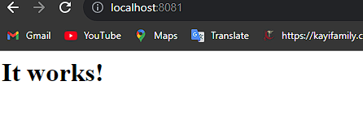

**Part 1: Docker Networking**

## Create a new Docker network

**Command**

```
docker network create my_network
```

**Output**

```
380444a34fbde286147f43e307933170067a57932ddb7e3abe15c30e7464d537
```

**To list all networks use**

```
docker network ls
```

**Output**

```
NETWORK ID     NAME         DRIVER    SCOPE
b0b2f2d285f7   bridge       bridge    local
6f08b931f0e9   host         host      local
380444a34fbd   my_network   bridge    local
9f28d5658a0b   none         null      local
```

## Create nginx container and connect with my_network

Create nginx image

Pull nginx image from <https://hub.docker.com/_/nginx>

Type following command in cmd

```
docker pull nginx:latest
```

Use following command to list images

```
docker images
```

Run nginx container and check local host

```
docker run -it --rm -d -p 8080:80 --name nginx_container nginx
```

Connect my_network with nginx_container

```
docker network connect my_network nginx_container
```

Docker container inspect nginx_container

Output

```
"NetworkID": "380444a34fbde286147f43e307933170067a57932ddb7e3abe15c30e7464d537",
"EndpointID": "1c07df08439685cf07b760e8653df78eefe04fc88772ad724b632315af57e534",
"Gateway": "172.18.0.1",
"IPAddress": "172.18.0.2",
 "IPPrefixLen": 16,
 "IPv6Gateway": "",
 "GlobalIPv6Address": "",
 "GlobalIPv6PrefixLen": 0,
 "MacAddress": "02:42:ac:12:00:02",
  "DriverOpts": {}
```

## Create httpd image/ container and connect with my_network

Create httpd image

Pull httpd image from docker hub

docker pull httpd:latest

Check the docker image of httpd

docker images

Run httpd container

docker run -it --rm -d -p 8081:80 --name httpd_container httpd

It will return a following page on browser **port 8081**



Connect my_network with nginx_container

```
docker network connect my_network httpd_container
```

## ‘docker network inspect my_network’ command

Output

```
[
{
"Name": "my_network",
"Id": "380444a34fbde286147f43e307933170067a57932ddb7e3abe15c30e7464d537",
"Created": "2023-11-10T16:40:11.147778762Z",
"Scope": "local",
"Driver": "bridge",
"EnableIPv6": false,
"IPAM": {
"Driver": "default",
"Options": {},
"Config": [
{
"Subnet": "172.18.0.0/16",
"Gateway": "172.18.0.1"
}
]
},
"Internal": false,
"Attachable": false,
"Ingress": false,
"ConfigFrom": {
"Network": ""
},
"ConfigOnly": false,
"Containers": {
"e32b219245eb372bd8e7e24945362665dd9e78174ca0d64f5e615ba64e36ede5": {
"Name": "httpd_container",
"EndpointID": "60dc32d550df18c5b9d991dc974f5294ff28412dd3b1529f08407c313d53ec19",
"MacAddress": "02:42:ac:12:00:02",
"IPv4Address": "172.18.0.2/16",
"IPv6Address": ""
}
},
"Options": {},
"Labels": {}
}
]
```

## Stop and remove the container

To stop container ‘httpd_container’ and remove it use following commands. It will automatically remove after stopping due –rm swich used earlier

```
docker stop httpd_container
```

for nginx container

```
docker stop nginx_container
```

## Create nginx_container_2

```
docker run -it --rm -d -p 8082:80 --name nginx_container_2 nginx
```

Check nginx default page appears on port 8082


**docker container ls**

```
CONTAINER ID   IMAGE   COMMAND                CREATED            STATUS              PORTS                  NAMES
fcad9f0b879f   nginx  "/docker-entrypoint.…"  About a minute ago  Up About a minute 0.0.0.0:8082->80/tcp   nginx_container_2
e32b219245eb   httpd  "httpd-foreground"      6 minutes ago       Up 6 minutes      0.0.0.0:8081->80/tcp   httpd_container
```

Stop and remove containers (although –rm switch above will automatically remove the containers once stoped but I am adding the command if you are not using rm switch)

```
docker stop httpd_container
docker stop nginx_container_2
docker rm httpd_container
docker rm nginx_container_2
```

Removing network

```
docker network rm my_network
```
